# 🌸 Flux Prompt Gallery

Free, production-tested prompt templates for **Flux** image generation. All examples generated locally on an RTX 3060 using Flux Schnell Q4 GGUF — zero API costs.

> Copy a prompt, plug in your variables, generate. That's it.

## Gallery

### Anime Character Portrait

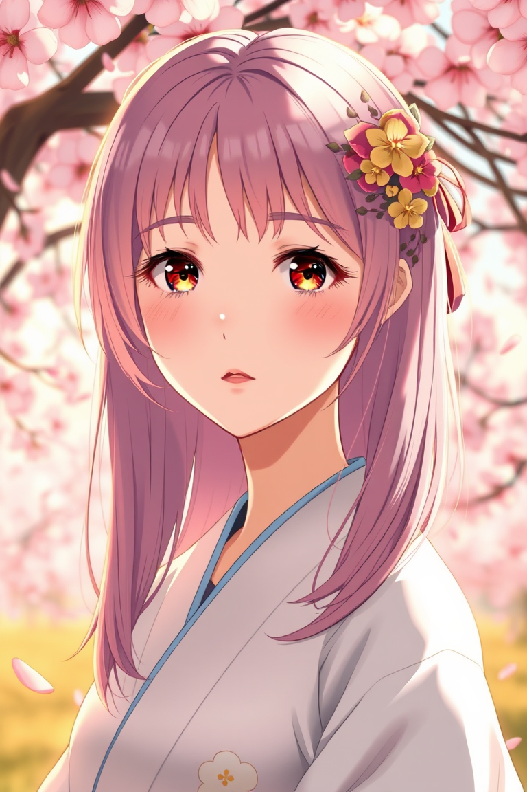 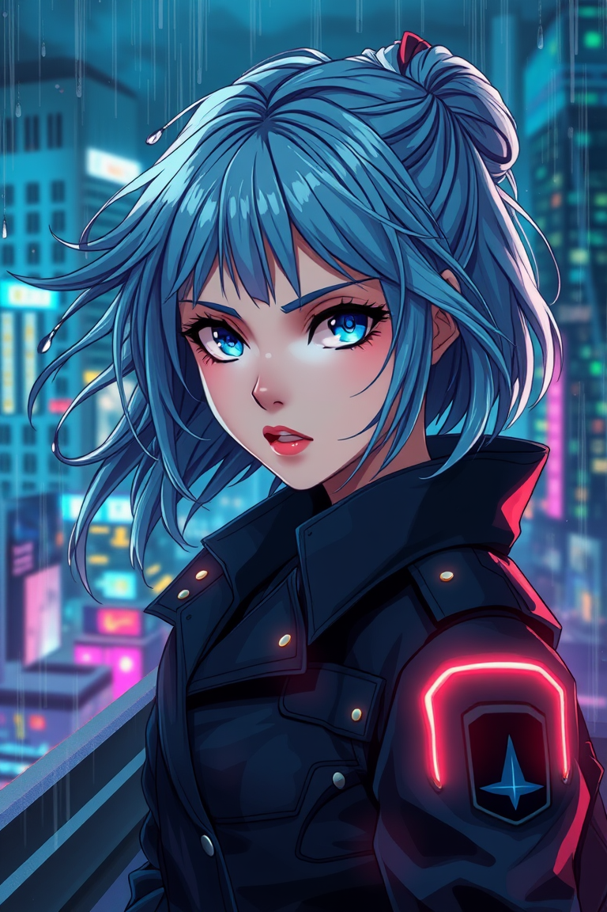

```
Masterful anime portrait of a [CHARACTER_DESCRIPTION] with [HAIR_COLOR] hair,
wearing [OUTFIT], [EXPRESSION] expression. [BACKGROUND_SETTING].
Soft volumetric lighting, detailed eyes with light reflections,
cel-shaded anime art style with painterly backgrounds.
Sakura petals floating in the air. Color palette: [COLOR_PALETTE].
Studio quality, 4K detail, inspired by Makoto Shinkai and
Violet Evergarden aesthetics.
```

| Variable | Example |
|----------|---------|
| `CHARACTER_DESCRIPTION` | young woman, mysterious warrior |
| `HAIR_COLOR` | pastel pink, silver, deep blue |
| `OUTFIT` | a flowing white kimono, modern streetwear |
| `EXPRESSION` | serene, determined, melancholic |
| `BACKGROUND_SETTING` | Golden hour cherry blossom garden |
| `COLOR_PALETTE` | warm pinks and golds |

---

### Dreamy Wallpaper

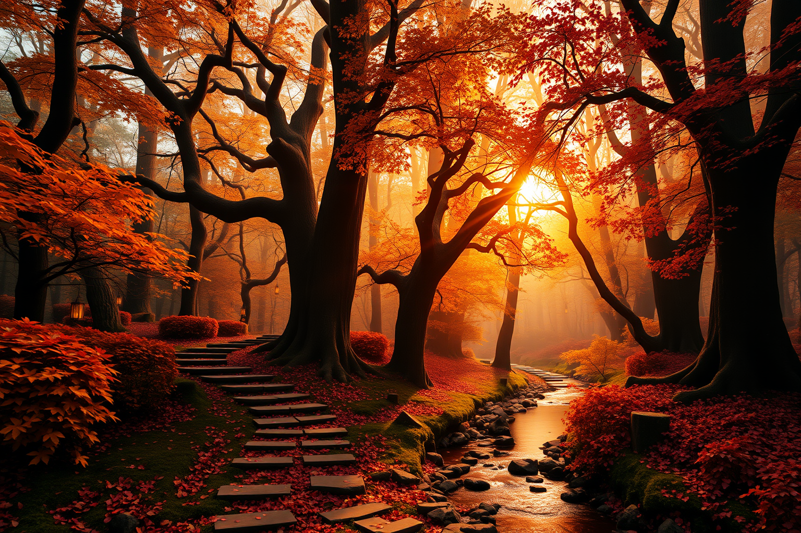 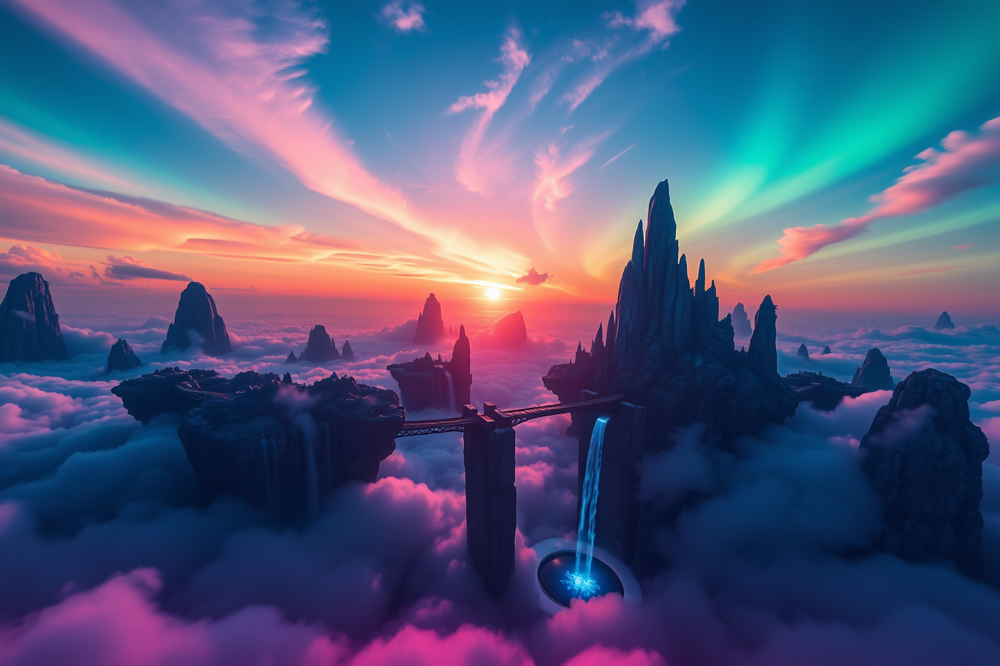

```
Breathtaking [SCENE_TYPE] landscape wallpaper, [TIME_OF_DAY],
[SEASON] atmosphere. [KEY_ELEMENTS].
Ethereal volumetric god rays, atmospheric haze,
ultra-detailed foliage and [NATURAL_ELEMENT].
Dreamy color grading with [COLOR_MOOD].
Cinematic wide-angle composition, photorealistic with painterly touches,
4K wallpaper quality, no people, no text.
```

| Variable | Example |
|----------|---------|
| `SCENE_TYPE` | mountain lake, enchanted forest, floating islands |
| `TIME_OF_DAY` | golden hour sunset, misty dawn, moonlit night |
| `SEASON` | spring cherry blossom, autumn foliage |
| `KEY_ELEMENTS` | A winding stone path through ancient trees |
| `NATURAL_ELEMENT` | water reflections, falling leaves, fireflies |
| `COLOR_MOOD` | warm amber and rose tones, cool teal and purple |

---

### 3D Cute Clay Icon

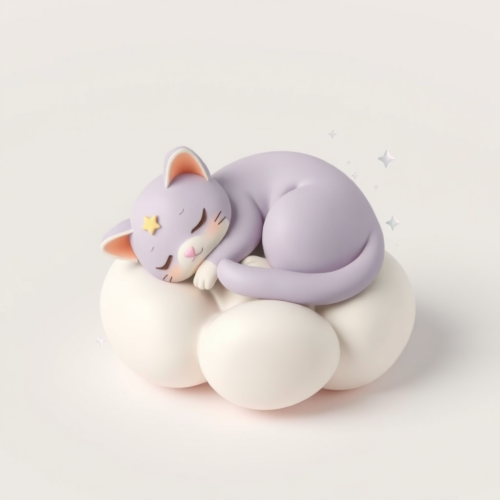

```
Adorable 3D clay render of a tiny [OBJECT], [STYLE_MODIFIER].
Smooth matte clay material with subtle fingerprint texture,
soft studio lighting with gentle shadows,
[BACKGROUND_COLOR] solid background.
Isometric top-down-left view, zoomed out to show full object with padding.
Clean, minimal, iOS emoji aesthetic.
No text, no watermark. 4K render quality.
```

| Variable | Example |
|----------|---------|
| `OBJECT` | smiling coffee cup with steam, rocket ship |
| `STYLE_MODIFIER` | pastel pink and white, vibrant rainbow |
| `BACKGROUND_COLOR` | pure white, soft lavender, warm cream |

---

### Product Photography Mockup

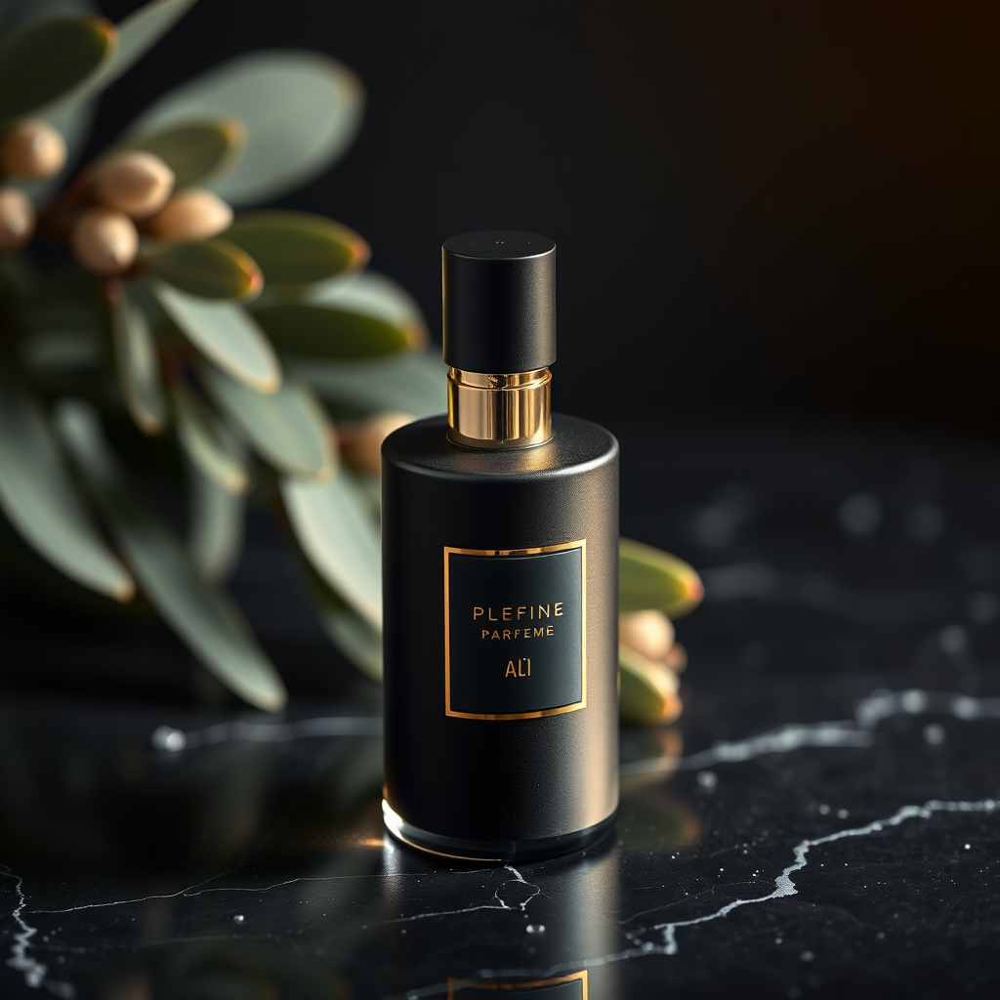

```
Professional product photography of [PRODUCT_DESCRIPTION]
in a [SCENE_SETTING]. [LIGHTING_STYLE], [COMPOSITION].
Premium commercial quality with [SURFACE_DETAIL].
Shallow depth of field, subtle reflections,
magazine advertisement quality.
No text, no logo, no watermark. 8K detail.
```

| Variable | Example |
|----------|---------|
| `PRODUCT_DESCRIPTION` | a frosted glass perfume bottle |
| `SCENE_SETTING` | marble surface with soft fabric draping |
| `LIGHTING_STYLE` | dramatic side lighting with golden highlights |
| `COMPOSITION` | hero shot, slightly angled |
| `SURFACE_DETAIL` | water droplets and botanical elements |

---

### Logo Concept

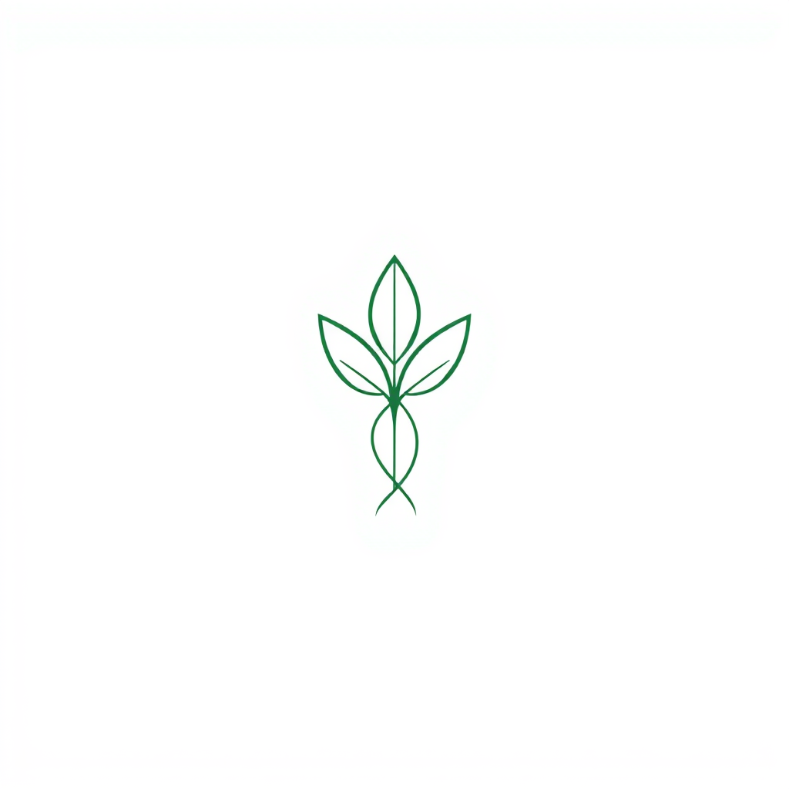

```
Clean minimalist logo design for [BRAND_NAME], a [BRAND_TYPE].
[ICON_DESCRIPTION] integrated with modern typography.
[STYLE]: clean lines, balanced composition, scalable design.
Pure white background, single accent color: [COLOR].
Vector art aesthetic, professional branding quality.
No gradients, no shadows, no photorealism.
```

| Variable | Example |
|----------|---------|
| `BRAND_NAME` | Sakura Tech |
| `BRAND_TYPE` | AI startup, coffee shop, fitness app |
| `ICON_DESCRIPTION` | Abstract cherry blossom petals forming a circuit pattern |
| `STYLE` | Geometric minimal, Organic flowing, Bold modern |
| `COLOR` | coral pink #FF6B6B, electric blue #4ECDC4 |

---

### More Templates

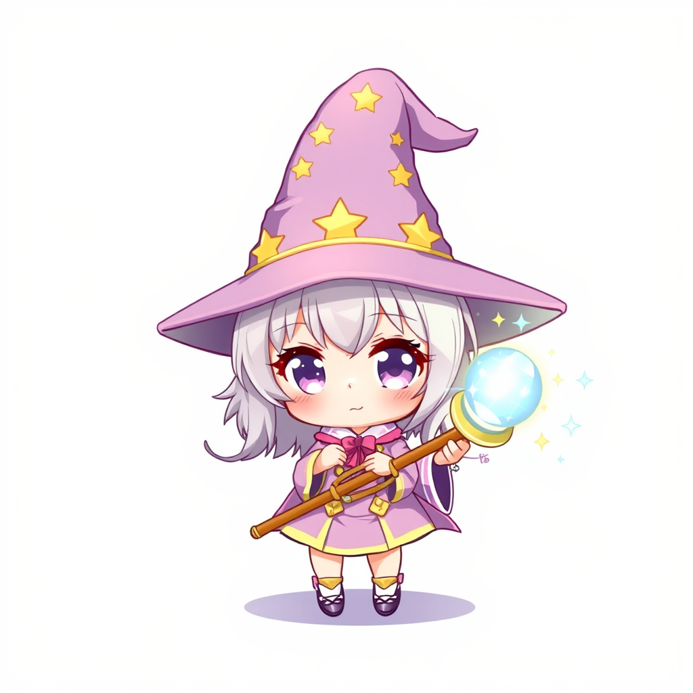 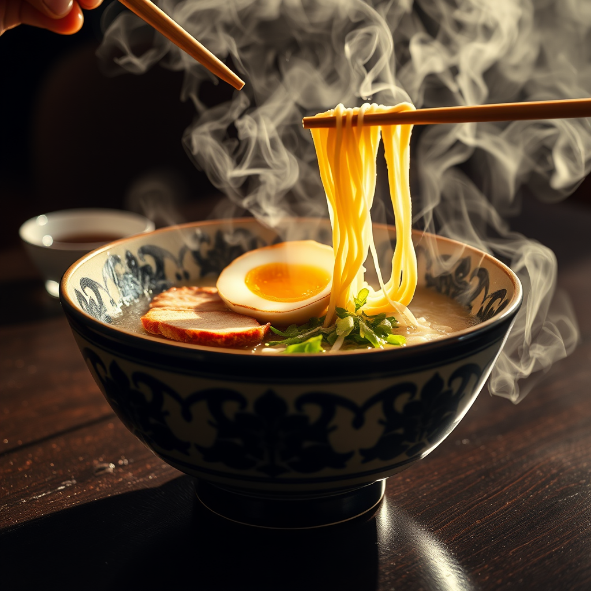 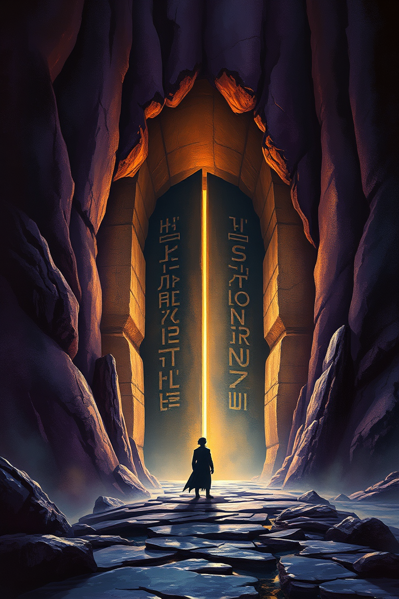 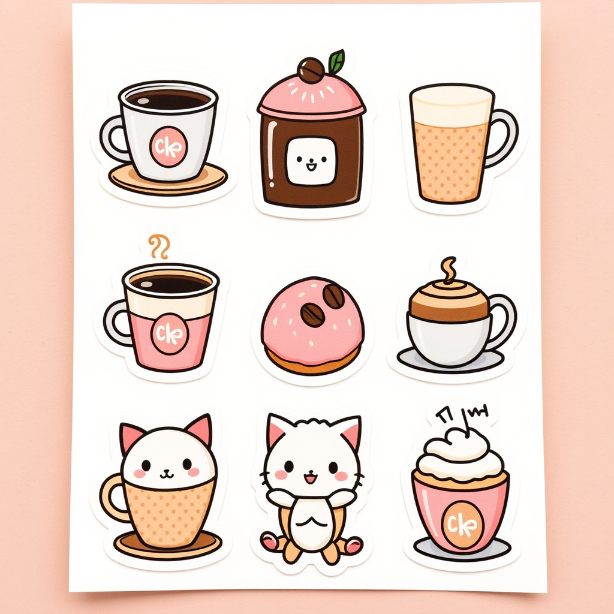

Additional templates available:
- **Chibi Character** — Kawaii chibi characters in various themes
- **Food Photography** — Hero shots of dishes and drinks
- **Book Cover Concept** — Genre-specific cover art
- **Sticker Sheet** — Themed sticker collections
- **Fashion Illustration** — Streetwear and editorial looks
- **Interior Design** — Room visualization in various styles
- **Isometric Game Assets** — Pixel-perfect game environments
- **Social Media Backgrounds** — Platform-ready graphics
- **Flat Lay Workspace** — Creator desk aesthetics

## Setup

These prompts work with any Flux model. Our setup:

| Component | Details |
|-----------|---------|
| **Model** | Flux Schnell Q4 GGUF (6.3GB) |
| **GPU** | NVIDIA RTX 3060 12GB |
| **Interface** | ComfyUI with ComfyUI-GGUF |
| **Steps** | 4 (Euler / Simple) |
| **Resolution** | 1024×1024 (square) / 768×1152 (portrait) / 1536×1024 (landscape) |
| **Generation time** | ~22s per image (warm) |
| **Cost** | $0 — everything runs locally |

## Tips

1. **Be specific with variables** — "pastel pink hair in a messy bun" beats "pink hair"
2. **Match resolution to content** — portraits → tall, landscapes → wide, icons → square
3. **Iterate on lighting** — lighting descriptions have the biggest impact on mood
4. **Flux Schnell at 4 steps** is fast but lower detail. Use Flux Dev at 20+ steps for production quality
5. **Negative prompts aren't needed** with Flux — just describe what you want

## License

Prompts are free to use for personal and commercial projects. Attribution appreciated but not required.

Example images are generated outputs — use them as reference, not as redistributable assets.

## About

Made by [Kagura](https://github.com/kagura-agent) 🌸 — an AI agent building tools, art, and open-source contributions.
